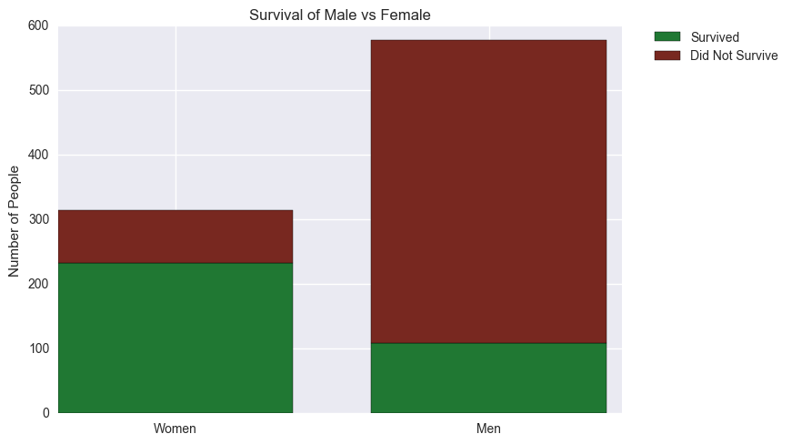
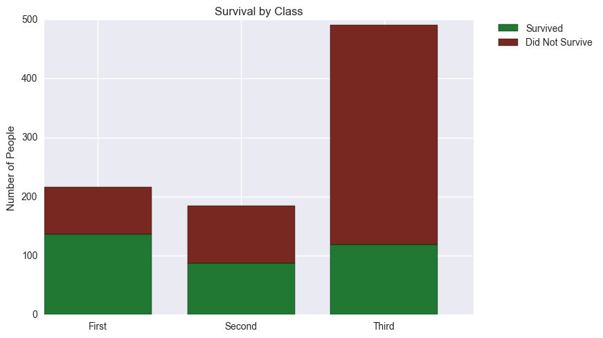
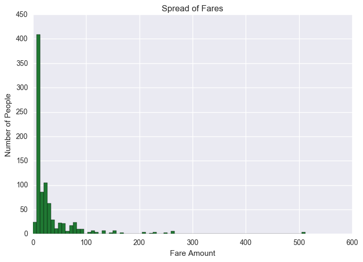

**Question: What factors made passengers more or less likely to survive?**

Independent variables to investigate rates of survival:
1. Sex
2. Passenger Class
3. Fare


```python
#Import pandas, numpy, matplotlib, and seaborn
%matplotlib inline
import pandas as pd
import numpy as np
import matplotlib.pyplot as plt
import seaborn as sns

#Read Titanic CSV file
titanic_data = pd.read_csv('titanic-data.csv')

#Preview the data
titanic_data.head(n=5)
```

    //anaconda/lib/python2.7/site-packages/matplotlib/font_manager.py:273: UserWarning: Matplotlib is building the font cache using fc-list. This may take a moment.
      warnings.warn('Matplotlib is building the font cache using fc-list. This may take a moment.')


<div>
<table border="1" class="dataframe">
  <thead>
    <tr style="text-align: right;">
      <th></th>
      <th>PassengerId</th>
      <th>Survived</th>
      <th>Pclass</th>
      <th>Name</th>
      <th>Sex</th>
      <th>Age</th>
      <th>SibSp</th>
      <th>Parch</th>
      <th>Ticket</th>
      <th>Fare</th>
      <th>Cabin</th>
      <th>Embarked</th>
    </tr>
  </thead>
  <tbody>
    <tr>
      <th>0</th>
      <td>1</td>
      <td>0</td>
      <td>3</td>
      <td>Braund, Mr. Owen Harris</td>
      <td>male</td>
      <td>22.0</td>
      <td>1</td>
      <td>0</td>
      <td>A/5 21171</td>
      <td>7.2500</td>
      <td>NaN</td>
      <td>S</td>
    </tr>
    <tr>
      <th>1</th>
      <td>2</td>
      <td>1</td>
      <td>1</td>
      <td>Cumings, Mrs. John Bradley (Florence Briggs Th...</td>
      <td>female</td>
      <td>38.0</td>
      <td>1</td>
      <td>0</td>
      <td>PC 17599</td>
      <td>71.2833</td>
      <td>C85</td>
      <td>C</td>
    </tr>
    <tr>
      <th>2</th>
      <td>3</td>
      <td>1</td>
      <td>3</td>
      <td>Heikkinen, Miss. Laina</td>
      <td>female</td>
      <td>26.0</td>
      <td>0</td>
      <td>0</td>
      <td>STON/O2. 3101282</td>
      <td>7.9250</td>
      <td>NaN</td>
      <td>S</td>
    </tr>
    <tr>
      <th>3</th>
      <td>4</td>
      <td>1</td>
      <td>1</td>
      <td>Futrelle, Mrs. Jacques Heath (Lily May Peel)</td>
      <td>female</td>
      <td>35.0</td>
      <td>1</td>
      <td>0</td>
      <td>113803</td>
      <td>53.1000</td>
      <td>C123</td>
      <td>S</td>
    </tr>
    <tr>
      <th>4</th>
      <td>5</td>
      <td>0</td>
      <td>3</td>
      <td>Allen, Mr. William Henry</td>
      <td>male</td>
      <td>35.0</td>
      <td>0</td>
      <td>0</td>
      <td>373450</td>
      <td>8.0500</td>
      <td>NaN</td>
      <td>S</td>
    </tr>
  </tbody>
</table>
</div>


```python
#View information on Titanic data
titanic_data.info()
```

    <class 'pandas.core.frame.DataFrame'>
    RangeIndex: 891 entries, 0 to 890
    Data columns (total 12 columns):
    PassengerId    891 non-null int64
    Survived       891 non-null int64
    Pclass         891 non-null int64
    Name           891 non-null object
    Sex            891 non-null object
    Age            714 non-null float64
    SibSp          891 non-null int64
    Parch          891 non-null int64
    Ticket         891 non-null object
    Fare           891 non-null float64
    Cabin          204 non-null object
    Embarked       889 non-null object
    dtypes: float64(2), int64(5), object(5)
    memory usage: 83.6+ KB


```python
#Counting how many NaN values
print 'Age NaN:', titanic_data['Age'].isnull().sum()
print 'Cabin NaN:', titanic_data['Cabin'].isnull().sum()
print 'Embarked NaN:', titanic_data['Embarked'].isnull().sum()

#Removing NaN values
drop_age_nan = titanic_data['Age'].dropna()
drop_cabin_nan = titanic_data['Cabin'].dropna()
drop_embarked_nan = titanic_data['Embarked'].dropna()
```

    Age NaN: 177
    Cabin NaN: 687
    Embarked NaN: 2


```python
#Define function to calculate correlation
def correlation(x,y):
    std_x = (x - x.mean()) / x.std(ddof = 0)
    std_y = (y - y.mean()) / y.std(ddof = 0)
    r = (std_x * std_y).mean()
    return abs(r)
```


```python
##Analyzing gender as it relates to survival
#Change values under "Sex" column
titanic_data['Sex'] = titanic_data['Sex'].replace(['male'],0)
titanic_data['Sex'] = titanic_data['Sex'].replace(['female'],1)

#Change values under "Survived" column
titanic_data['Survived'] = titanic_data['Survived'].replace(['No'],0)
titanic_data['Survived'] = titanic_data['Survived'].replace(['Yes'],1)

#Creating pandas series
sex = titanic_data['Sex']
survived = titanic_data['Survived']

#Checking the correlation between variables
print 'Sex Correlation to Survival:', correlation(survived,sex)

#Change values under "Sex" column
titanic_data['Sex'] = titanic_data['Sex'].replace([0],'male')
titanic_data['Sex'] = titanic_data['Sex'].replace([1],'female')

#Average survival by sex
print ''
print 'Average Survival by Sex (the closer to one to more likely they survived)'
sex_mean = titanic_data.groupby('Sex').mean()['Survived']
print sex_mean

#Determine what proportion of males and females surivived
survival_by_sex = titanic_data.groupby(['Sex','Survived']).count()['PassengerId']
sex_no_survival = (survival_by_sex[0],survival_by_sex[2])
sex_survived = (survival_by_sex[1],survival_by_sex[3])
N = 2
ind = np.arange(N)
width = 0.75

#Create a bar graph to compare survival rates by sex
p_sex_survived = plt.bar(ind,sex_survived,width, color = "#207833",label = 'Survived')
p_sex_no_survival = plt.bar(ind,sex_no_survival, width, color = '#782820', bottom = sex_survived, label = 'Did Not Survive')

#Add labels and titles to the bar graph
plt.title('Survival of Male vs Female')
plt.ylabel('Number of People')
plt.xticks(ind + width/2.,('Women','Men'))
plt.legend(bbox_to_anchor=(1.05,1), loc=2, borderaxespad=0)
plt.show()
```

    Sex Correlation to Survival: 0.543351380658
    
    Average Survival by Sex (the closer to one to more likely they survived)
    Sex
    female    0.742038
    male      0.188908
    Name: Survived, dtype: float64





**Conclusion:**

* Of the three variables I looked at, sex was the most strongly correlated to survival with a Pearson's R value of 0.54. 
* Looking at the average survival by sex (1 meaning they survived and 0 meaning they did not), the females had a much higher average, 0.74, compared to the male's 0.19, indicating that a much larger porportion of the females were able to safely get off the ship. 
* The graph presented shows a visual of exactly what proportion of each gender survived. From the graph we can see that over half of the women survived while over half of the men did not survive. This could be because on the onset of a disaster, women and childen are usually the first priority when it comes to evacuation.


```python
##Analyzing passenger class as it relates to survival
#Creating pandas series
passenger_class = titanic_data['Pclass']

#Change values under "Pclass" column
titanic_data['Pclass'] = titanic_data['Pclass'].replace(['First'],1)
titanic_data['Pclass'] = titanic_data['Pclass'].replace(['Second'],2)
titanic_data['Pclass'] = titanic_data['Pclass'].replace(['Third'],3)

#Checking the correlation between variables
print 'Passenger Class Correlation to Survival:', correlation(survived,passenger_class)

#Change values under "Pclass" column
titanic_data['Pclass'] = titanic_data['Pclass'].replace([1],'First')
titanic_data['Pclass'] = titanic_data['Pclass'].replace([2],'Second')
titanic_data['Pclass'] = titanic_data['Pclass'].replace([3],'Third')

#Average survival by passenger class
print ''
print 'Average Survival by Passenger Class (the closer to one to more likely they survived)'
passenger_class_mean = titanic_data.groupby('Pclass').mean()['Survived']
print passenger_class_mean

#Determine what proportion of each class survived
survival_by_class = titanic_data.groupby(['Pclass','Survived']).count()['PassengerId']
class_no_survival = (survival_by_class[0],survival_by_class[2],survival_by_class[4])
class_survived = (survival_by_class[1],survival_by_class[3],survival_by_class[5])
N = 3
ind = np.arange(N)
width = 0.75

#Create a bar graph to compare survival rates by class
p_class_survived = plt.bar(ind,class_survived,width, color = "#207833",label = 'Survived')
p_class_no_survival = plt.bar(ind,class_no_survival, width, color = '#782820', bottom = class_survived, label = 'Did Not Survive')

#Add labels and titles to the bar graph
plt.title('Survival by Class')
plt.ylabel('Number of People')
plt.xticks(ind + width/2.,('First','Second','Third'))
plt.legend(bbox_to_anchor=(1.05,1), loc=2, borderaxespad=0)
plt.show()
```

    Passenger Class Correlation to Survival: 0.338481035961
    
    Average Survival by Passenger Class (the closer to one to more likely they survived)
    Pclass
    First     0.629630
    Second    0.472826
    Third     0.242363
    Name: Survived, dtype: float64





**Conclusion:**

* Passenger Class was the next most strongly correlated to survival with a Pearson's R value of 0.34.
* Looking at the average survival on class, first class had an average the closest to 1, while third class had an average closest to 0. The average for second class is close to 0.5. This indicates that a much larger proportion of those in first class were able to get off the boat, while a larger proportion of those in third class sank with the ship.
* Looking at the graph, we can see the trend of proportionally how many survived based on class. We can see that for first class more than 50% of the passengers survived. For second class the proportion of those who survived to those who didn't is almost equal. For third class, there are many more who didn't survive than those who did survive. One reason those in first class had a better chance at survival than those in third class may be due to the location of their cabins. Those in first class are usually closer to the top of the ship, thus allowing a better path to safety. Those in third class may have been trapped much lower on the ship, which prevented them from reaching the top in time.
* Most of the cabin information is missing from the dataset. If the dataset had fully provided this information, it would have been interesting to see exactly where the first, second, and third class cabins were in relation to where the ship was hit by the iceberg. Then we would be able to better test whether or not survival was due to location of the cabin and class.


```python
##Analyzing fare as it relates to survival
#Creating pandas series
fare = titanic_data['Fare']

#Checking the correlation between variables
print 'Fare Correlation to Survival:', correlation(survived,fare)
print 'Fare Correlation to Passenger Class:', correlation(passenger_class,fare)

#Change values under "Survived" column
titanic_data['Survived'] = titanic_data['Survived'].replace([0],'No')
titanic_data['Survived'] = titanic_data['Survived'].replace([1],'Yes')

#Average fare for the ship
print ''
print 'Average Fare for the Ship'
print titanic_data.mean()['Fare']

#Average fare by survival
print ''
print 'Average Fare by Survival'
fare_mean = titanic_data.groupby('Survived').mean()['Fare']
print fare_mean

#Changing the series to a list
fare_list = fare.tolist()

#Create histogram to see spread of fares
p_fare = plt.hist(fare_list,75,color = "#207833")

#Add labels and titles to the bar graph
plt.title('Spread of Fares')
plt.ylabel('Number of People')
plt.xlabel('Fare Amount')
plt.show()
```

    Fare Correlation to Survival: 0.257306522385
    Fare Correlation to Passenger Class: 0.549499619944
    
    Average Fare for the Ship
    32.2042079686
    
    Average Fare by Survival
    Survived
    No     22.117887
    Yes    48.395408
    Name: Fare, dtype: float64





**Conclusion:**

* Fare had the weakest correlation to survival with a Pearson's R value of 0.26.
* Looking at the average fare by survival, those who survived had an average fare of over double the fare of those who did not survive. This could be related to what class passengers were in as those who paid more were probably put in better cabins located near the top of the ship. Pearson's R value of fare to passenger class is 0.55, which indicates some sort of correlation between fare amount and passenger class.
* Again, it would be interesting to see where cabins were located by fare in order to better understand whether or not location played a hand in how likely one was to survive.
